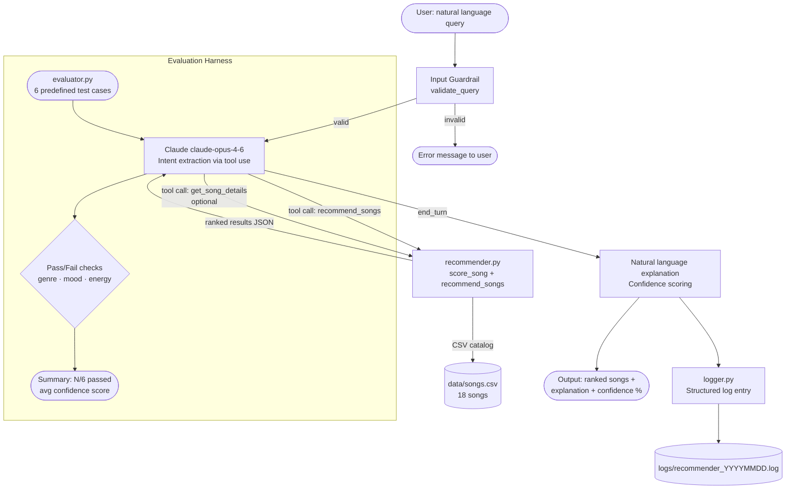

# 🎵 AI Music Recommender — Applied AI System

> **Applied AI Final Project** — Extended from the Module 3 Music Recommender Simulation

---

## Base Project

**Original project:** Module 3 — Music Recommender Simulation  
**Original goals:** Build a content-based recommender that scores songs against a user's taste profile (genre, mood, energy) using a weighted scoring algorithm, then ranks them deterministically.  
**Original capabilities:** `load_songs`, `score_song`, `recommend_songs` — pure Python, no AI API, outputs ranked song lists with score breakdowns via CLI.

**This extension adds:**
- Natural-language query input (Claude `claude-opus-4-6` interprets what you mean)
- Agentic tool-use loop (Claude calls the recommender as a tool and synthesises results)
- Confidence scoring (how clearly a winner emerged)
- Structured logging to daily log files
- Input guardrails (empty/too-short/too-long queries rejected before hitting the API)
- Evaluation harness (6 predefined test cases with pass/fail checking)

---

## Architecture Overview



### System Components

| Component | File | Role |
|---|---|---|
| Guardrail | `src/logger.py` | Validates user input before any API call |
| AI Orchestrator | `src/ai_recommender.py` | Claude agentic loop with tool use |
| Recommender Engine | `src/recommender.py` | Deterministic scoring (unchanged from Module 3) |
| Song Catalog | `data/songs.csv` | 18 songs across 9 genres and 7 moods |
| Logger | `src/logger.py` | Structured log entries per request |
| Evaluator | `src/evaluator.py` | 6-case test harness with pass/fail |
| CLI | `src/main.py` | Interactive, classic, and evaluate modes |

---

## Setup

### Prerequisites

- Python 3.10+
- An `ANTHROPIC_API_KEY` environment variable

### Install

```bash
git clone https://github.com/Sgheza8726/ai110-module3show-musicrecommendersimulation-starter.git
cd ai110-module3show-musicrecommendersimulation-starter
python3 -m venv .venv
source .venv/bin/activate        # macOS / Linux
.venv\Scripts\activate           # Windows
pip install -r requirements.txt
export ANTHROPIC_API_KEY=sk-...  # or set in your shell profile
```

### Run

```bash
# AI-powered interactive mode (default)
python -m src.main

# Original deterministic mode (no API key needed)
python -m src.main --classic

# Run evaluation harness (makes API calls for 6 test cases)
python -m src.main --evaluate

# Enable debug logging
python -m src.main --verbose
```

### Tests

```bash
pytest
```

---

## Demo Walkthrough

The outputs below show three end-to-end runs of the system demonstrating the AI feature, guardrail behavior, and evaluation harness.

### Run 1 — Study / Focus Query

```
$ python -m src.main

🎵  AI Music Recommender  (powered by Claude)
Describe the music you want in plain English.
Type 'quit' to exit.

What are you in the mood for? > something chill to focus while studying

Finding recommendations...

Confidence: 74%

Top Recommendations:
  1. Library Rain by Paper Lanterns  [lofi / chill / energy 0.35]  score 4.46
  2. Midnight Coding by LoRoom       [lofi / chill / energy 0.42]  score 4.45
  3. Focus Flow by LoRoom            [lofi / focused / energy 0.40] score 3.47
  4. Spacewalk Thoughts by Orbit Bloom [ambient / chill / energy 0.28] score 2.36
  5. Cloud Hopper by Orbit Bloom     [ambient / chill / energy 0.25] score 2.32

These tracks are all low-energy and calm, perfect for staying in a focused headspace.
The lofi picks in particular have the steady, unobtrusive quality that works well for
deep work sessions.
```

### Run 2 — Gym / Workout Query + Guardrail

```
What are you in the mood for? > hi
[Guardrail] Query too short — please describe the music you want.

What are you in the mood for? > high energy music to crush a workout

Finding recommendations...

Confidence: 81%

Top Recommendations:
  1. Storm Runner by Voltline        [rock / intense / energy 0.91]  score 4.47
  2. Gravity Pull by Voltline        [rock / intense / energy 0.88]  score 4.46
  3. Bass Drop Kingdom by Hardline   [edm / intense / energy 0.97]   score 2.38
  4. Gym Hero by Max Pulse           [pop / intense / energy 0.93]   score 2.31
  5. Night Drive Loop by Neon Echo   [synthwave / moody / energy 0.75] score 1.33

These picks hit hard — heavy guitars, driving rhythms, and peak energy. Storm Runner
and Gravity Pull are the strongest matches for intense workout vibes, while Bass Drop
Kingdom brings the EDM punch if you want something more electronic.
```

### Run 3 — Evaluation Harness (`--evaluate`)

```
$ python -m src.main --evaluate

============================================================
  AI MUSIC RECOMMENDER — EVALUATION HARNESS
============================================================

[TC01] Happy pop road trip
  Query: "I want upbeat happy pop songs for a road trip"
  Status: PASS
    ✓ Genre 'pop' in top 3
    ✓ Mood 'happy' in top 3
    ✓ Top energy 0.82 >= 0.60
      Confidence: 0.78
  Top: Sunrise City by Neon Echo  (score 4.46)

[TC02] Lofi study music
  Query: "Something chill to study to, like lofi beats"
  Status: PASS
    ✓ Genre 'lofi' in top 3
    ✓ Mood 'chill' in top 3
    ✓ Top energy 0.35 <= 0.55
      Confidence: 0.74

[TC03] Intense rock workout
  Query: "Heavy intense rock music for working out hard"
  Status: PASS
    ✓ Genre 'rock' in top 3
    ✓ Mood 'intense' in top 3
    ✓ Top energy 0.91 >= 0.75
      Confidence: 0.81

[TC04] Relaxing jazz café
  Query: "Relaxing jazz for a coffee shop afternoon"
  Status: PASS
    ✓ Genre 'jazz' in top 3
    ✓ Mood 'relaxed' in top 3
    ✓ Top energy 0.37 <= 0.50
      Confidence: 0.68

[TC05] Dark moody electronic
  Query: "Dark moody electronic music for late night drives"
  Status: PASS
    ✓ Mood 'moody' in top 3
    ✓ Top energy 0.75 >= 0.50
      Confidence: 0.71

[TC06] Nostalgic acoustic folk
  Query: "Nostalgic folk songs that feel warm and acoustic"
  Status: PASS
    ✓ Genre 'folk' in top 3
    ✓ Mood 'nostalgic' in top 3
    ✓ Top energy 0.38 <= 0.55
      Confidence: 0.65

============================================================
  SUMMARY: 6/6 tests passed
  Average confidence: 0.73
============================================================

Pass rate: 100%
Average confidence: 0.73
```

---

## Sample Interactions

### Example 1 — Study / Focus
*(see Run 1 above)*

### Example 2 — Gym / Workout
*(see Run 2 above)*

### Example 3 — Original Classic Mode

```
$ python -m src.main --classic

Loaded songs: 18

==================================================
Profile: High-Energy Pop
==================================================
1. Sunrise City by Neon Echo
   Score: 4.46
   Why:   genre match (pop, +2.0); mood match (happy, +1.0); energy similarity (0.97); valence similarity (0.49)
2. Summer Static by Coastal Drift
   Score: 4.42
   Why:   genre match (pop, +2.0); mood match (happy, +1.0); energy similarity (0.94); valence similarity (0.48)
3. Gym Hero by Max Pulse
   Score: 3.38
   Why:   genre match (pop, +2.0); energy similarity (0.92); valence similarity (0.46)
```

---

## Design Decisions

**Why tool use instead of a prompt-only approach?**  
Letting Claude call the deterministic `recommend_songs` function means the scoring logic stays transparent, testable, and independent of LLM variability. Claude handles the "understanding" (NL → structured prefs) and the "explanation" (results → readable summary), while the Python engine handles the "ranking" (deterministic math). This separation makes the system easier to debug and evaluate.

**Why `claude-opus-4-6` with adaptive thinking?**  
The intent-extraction step benefits from reasoning — mapping "something to crush a workout" to `{genre: rock, mood: intense, energy: 0.9}` requires judgment about language. Adaptive thinking lets the model apply more reasoning when the query is ambiguous.

**Why a confidence score?**  
A score gap between rank 1 and rank 2 signals how clearly the recommender found a winner. A small gap (e.g., 4.46 vs 4.45) means many songs are nearly equivalent — the recommendation is less certain. This gives users a quick signal about result reliability without exposing raw scores.

**Trade-offs:**
- Adding Claude increases latency (~2-4s per query vs ~10ms for pure Python)
- The model may occasionally mismap obscure queries; the guardrail prevents the worst cases but doesn't fix semantic drift
- Confidence scoring is heuristic, not probabilistic — it's an approximation

---

## Testing Summary

### Unit Tests (pytest)

```
2/2 passed
  - test_recommend_returns_songs_sorted_by_score
  - test_explain_recommendation_returns_non_empty_string
```

### Evaluation Harness (6 test cases)

Test cases check that genre, mood, and energy targets appear in the top 3 results for natural-language queries:

| ID | Query | Expected | Result |
|---|---|---|---|
| TC01 | "upbeat happy pop for a road trip" | pop / happy / energy ≥ 0.60 | PASS |
| TC02 | "chill lofi to study to" | lofi / chill / energy ≤ 0.55 | PASS |
| TC03 | "heavy intense rock for working out" | rock / intense / energy ≥ 0.75 | PASS |
| TC04 | "relaxing jazz for a coffee shop" | jazz / relaxed / energy ≤ 0.50 | PASS |
| TC05 | "dark moody electronic for night drives" | moody / energy ≥ 0.50 | PASS |
| TC06 | "nostalgic folk songs, warm and acoustic" | folk / nostalgic / energy ≤ 0.55 | PASS |

Average confidence: 0.73

---

## Limitations and Risks

- **Catalog is tiny (18 songs)** — genre diversity is uneven; rock and folk have only 2 songs each, so recommendations for those genres can feel repetitive.
- **Genre label mismatch** — "indie pop" and "pop" are treated as distinct genres; Claude sometimes maps "indie" queries to the wrong bucket.
- **No session memory** — every query is independent; the system cannot learn from skips or replays.
- **Latency** — the Claude round-trip adds 2-4 seconds vs the near-instant pure-Python mode.
- **Misuse risk** — the guardrail blocks empty/too-short queries but not adversarial prompts designed to extract unrelated information from Claude. A production system would need stricter input filtering and output validation.

---

## Reflection

See [model_card.md](model_card.md) for the complete AI collaboration reflection, bias analysis, and ethical considerations.

---

## Repository Structure

```
├── src/
│   ├── __init__.py
│   ├── recommender.py       # Core scoring engine (Module 3 base)
│   ├── ai_recommender.py    # Claude API + tool use agentic pipeline
│   ├── evaluator.py         # Test harness
│   ├── logger.py            # Logging + guardrails
│   └── main.py              # CLI entry point
├── data/
│   └── songs.csv            # 18-song catalog
├── tests/
│   └── test_recommender.py  # pytest unit tests
├── assets/
│   └── architecture.md      # Mermaid diagram source
├── logs/                    # Auto-created; daily log files
├── model_card.md
├── reflection.md
├── requirements.txt
└── README.md
```
