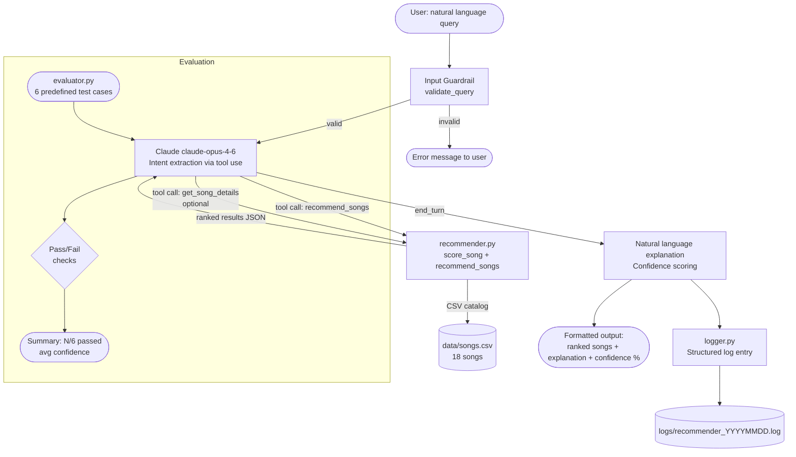

# System Architecture — AI Music Recommender

## Mermaid Diagram Source

Export this diagram to PNG at https://mermaid.live and save the image as `assets/architecture.png`.



## Component Descriptions

| Component | File | Responsibility |
|---|---|---|
| Input Guardrail | `src/logger.py` | Rejects empty, too-short, or too-long queries before hitting the API |
| Intent Extractor | `src/ai_recommender.py` | Claude agentic loop — interprets NL query, calls tools, generates explanation |
| Recommender Engine | `src/recommender.py` | Deterministic scoring (genre +2.0, mood +1.0, energy similarity, valence similarity) |
| Song Catalog | `data/songs.csv` | 18 songs across 9 genres and 7 moods |
| Logger | `src/logger.py` | Logs every query, result count, confidence, and token usage to daily log file |
| Evaluator | `src/evaluator.py` | Test harness with 6 predefined cases; checks genre, mood, energy expectations |
| CLI | `src/main.py` | Unified entry point for interactive, classic, and evaluate modes |

## Data Flow Summary

```
User Input (natural language)
    ↓ [validate_query guardrail]
Claude API — tool use loop
    ↓ calls recommend_songs(genre, mood, energy, ...)
    ↓ calls get_song_details(title)  [optional follow-up]
recommender.py scores all 18 songs → returns top K
    ↓ JSON results back to Claude
Claude generates 2-3 sentence explanation
    ↓
Output: ranked list + explanation + confidence score
    ↓
logger.py writes structured log entry
```
